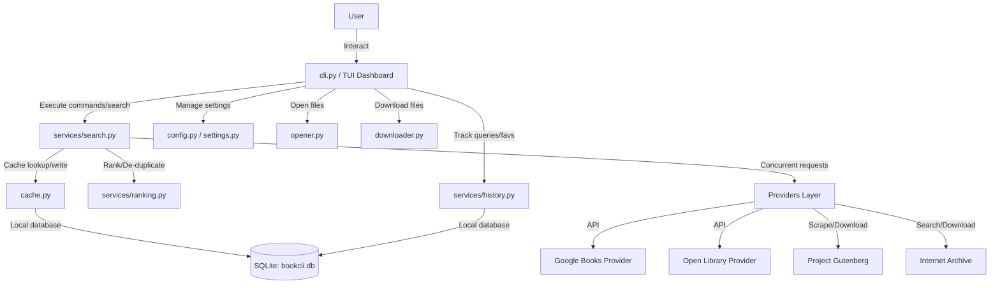

# 📚 BookCLI

[](https://www.python.org/)
[](https://opensource.org/licenses/MIT)
[](https://github.com/greycode009)
[](https://github.com/greycode009)

BookCLI is a production-grade, clean-architecture command-line interface (CLI) application built in Python 3.12+. It enables you to concurrently search multiple legal book sources, intelligently rank and merge metadata, cache details locally, and safely download public domain/free books directly from the terminal with a beautiful Rich UI.

```text
██████╗  ██████╗  ██████╗ ██╗  ██╗ ██████╗██╗     ██╗
██╔══██╗██╔═══██╗██╔═══██╗██║ ██╔╝██╔════╝██║     ██║
██████╔╝██║   ██║██║   ██║█████╔╝ ██║     ██║     ██║
██╔══██╗██║   ██║██║   ██║██╔═██╗ ██║     ██║     ██║
██████╔╝╚██████╔╝╚██████╔╝██║  ██╗╚██████╗███████╗██║
╚══════╝  ╚═════╝  ╚═════╝ ╚═╝  ╚═╝ ╚═════╝╚══════╝╚═╝
     Search, inspect, and legally download books
          Powered by Open Library & Gutenberg
              Developer - Dipesh Malla
                 GitHub : greycode009
```

---

## 🌟 Key Features

*   **⚡ Concurrent Multi-Provider Search**: Queries Google Books, Open Library, Project Gutenberg, and the Internet Archive concurrently using async/await handlers.
*   **📊 Clean & Interactive TUI Dashboard**: Launch the dashboard menu with zero arguments to browse options, review search history, access favorites, inspect cache stats, and customize app configurations.
*   **🧠 Intelligent Deduplication & Ranking**: Merges results from all providers using `RapidFuzz` fuzzy matching on title/author strings. Automatically ranks entries based on metadata completeness and direct download availability.
*   **🔒 Safe & Legal Downloads**: Only downloads books that are explicitly public domain or marked as free by their host provider.
*   **⏬ HTTP Range-Resume Downloads**: Supports HTTP Range headers for downloading larger books safely; auto-resumes interrupted connections with standard `Rich` progress displays.
*   **📂 Direct OS File Integration**: Automatically launch downloaded books (EPUB, PDF, TXT) inside your default OS-registered reader using standard process controls.
*   **💾 Local Caching & Offline State**: Backed by a local SQLite database using `aiosqlite`, providing fast offline retrieval of previously searched metadata, history logs, and favorites.
*   **🛠️ Flexible Configurations**: Toggle providers, set custom cache TTLs, change client timeout constraints, and update default download pathways directly from the CLI or dashboard settings.

---

## 🏛️ Clean Architecture

The codebase adheres strictly to Clean Architecture principles to separate core services, data layers, providers, and presentation:



### Directory Layout

```text
bookcli/
├── database/            # Database initialization and schema migrations
│   └── migrations.py
├── providers/           # Concretely implemented API / web providers
│   ├── base.py          # Abstract base client provider
│   ├── google_books.py
│   ├── gutenberg.py
│   ├── internet_archive.py
│   └── openlibrary.py
├── services/            # Pure domain services (business rules)
│   ├── history.py       # Query log tracking
│   ├── ranking.py       # Metadata scoring and deduplication (RapidFuzz)
│   └── search.py        # Orchestrates concurrent API querying & caching
├── cache.py             # SQLite metadata cache mechanisms
├── cli.py               # Typer/Rich CLI interface and main interactive loop
├── config.py            # Pydantic models for configuration and serialization
├── downloader.py        # Async downloader with range-resume & rich progress bars
├── exceptions.py        # Domain-specific custom exception hierarchy
├── opener.py            # Platform-specific document launcher
├── settings.py          # Default constants and path configuration directories
└── utils.py             # Clean utilities (unit formatting, filenames)
```

---

## 🚀 Installation

Ensure you have **Python 3.12+** installed on your system.

1.  **Clone the Repository**
    ```bash
    git clone https://github.com/Greycode009/bookcli.git
    cd bookcli
    ```

2.  **Install in Editable Mode**
    ```bash
    pip install -e .
    ```

### Command Execution wrappers
Once installed, the CLI tool is available globally as the `book` command. If the python script directory is not present on your `PATH`, you can use the wrappers provided in the project root:
*   **Windows (PowerShell/CMD)**: `.\book.bat <command>`
*   **Linux / macOS / Git Bash**: `./book <command>`
*   **Python Direct Module**: `python -m bookcli.cli <command>`

---

## 🎮 How to Use

### 🖥️ 1. The Interactive Dashboard
Run `book` without arguments in an interactive terminal to enter the console dashboard:
```bash
book
```
This launches a complete navigation dashboard:
1.  **🔍 Search Books**: Prompts for a search query and filters, then displays search results.
2.  **📜 Search History**: Shows list of past queries. Includes an option to clear history.
3.  **⭐ Favorite Books**: Displays all favorited items with quick options to download (`d <index>`), open in reader (`o <index>`), or remove (`r <index>`).
4.  **⚡ Metadata Cache Stats**: Shows cache storage metadata sizes.
5.  **🧹 Clear Metadata Cache**: Evicts database-cached search metadata.
6.  **⚙️ Settings / Configuration**: Change active settings interactively (download path, client timeouts, toggling search providers).
7.  **Exit Dashboard**.

#### Inline Search Explorer Actions
Inside the **Search Books** menu:
*   Enter `<ID>` to download the book (e.g., `1`).
*   Enter `<ID> -o <path>` or `<ID> --output <path>` to save to a custom path (e.g., `1 -o C:\downloads` or `1 -o book.epub`).
*   Enter `i <ID>` to show complete details (description, pages, published year, publishers, ISBN).
*   Enter `f <ID>` to add to favorites.
*   Enter `o <ID>` to open a downloaded file in the OS default reader.
*   Enter `q` to return to the main dashboard menu.

---

### ⚙️ 2. Direct CLI Command Reference

If you prefer to bypass the dashboard, you can invoke direct commands from your shell:

#### Concurrently Search Providers
```bash
book search "Clean Architecture"
```
Filter searches by specific parameters:
```bash
book search "Relativity" --subject "Physics"
book search "Refactoring" --author "Martin Fowler"
```
Export results directly to a structured file:
```bash
book search "Science" --export results.json
book search "History" --export history_books.csv
```

#### Get Detailed Information
View structured metadata cards of search entries using either a short session ID (e.g., `1`, `2`) from your last search or a provider-specific key (e.g., `gutenberg:1342`):
```bash
book info 1
```

#### Download Books Legally
Download files with async resume support and live progress bars. Custom output paths automatically resolve folder hierarchies:
```bash
# Save to default downloads folder (~/.bookcli/downloads)
book download 1

# Save to custom directory
book download 1 --output "D:\Books"

# Save to custom file path
book download 1 -o "/Users/greycode/Desktop/design_patterns.epub"
```

#### Open Files Instantly
Fire up files inside the OS default viewer:
```bash
book open 1
```

#### Manage Favorites
```bash
book favorite add 1
book favorite list
book favorite remove gutenberg:1342
```

#### Manage Cache and History
```bash
# Show cache count and storage dates
book cache stats

# Remove all cached records
book cache clear

# List past search queries
book history
```

#### Modify Settings
Show settings or update values:
```bash
# Display settings
book config

# Set default downloads directory
book config set download-dir "C:\Users\Dipesh\Downloads"

# Adjust network client timeout
book config set timeout 20

# Disable Google Books search provider
book config set provider false google-books
```

---

## 🛠️ Development & Testing

### Running Tests
To run the project test suites (if `pytest` is installed in your python environment):
```bash
python -m pytest --cov=bookcli
```

### Data Storage Directories
By default, BookCLI stores its application databases and configurations in:
*   **Default directory**: `~/.bookcli/` (resolves to `C:\Users\<User>\.bookcli` on Windows)
*   **Database**: `~/.bookcli/bookcli.db`
*   **Settings File**: `~/.bookcli/config.json`
*   **Download Path**: `~/.bookcli/downloads/`

You can redirect the home directory by setting the `BOOKCLI_HOME` environment variable.

---

## 👤 Author

*   **Dipesh Malla**
    *   GitHub: [@greycode009](https://github.com/greycode009)
    *   Repository: [https://github.com/Greycode009/bookcli](https://github.com/Greycode009/bookcli)

---

## 📄 License

This project is licensed under the MIT License - see the `LICENSE` file for details.
